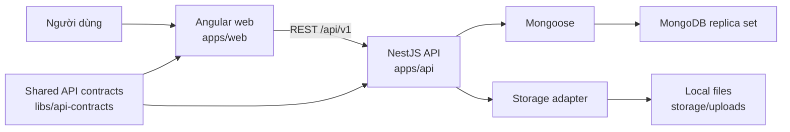

# IDS PMS — Project Overview

## Mục tiêu

IDS PMS là hệ thống web quản lý dự án nội bộ. Phạm vi nghiệp vụ chi tiết vẫn cần được khách hàng xác nhận; kiến trúc hiện tại được dựng để phát triển tăng dần mà không khóa cứng các phần chưa chốt.

## Trạng thái hiện tại

Đã có foundation cùng hai vertical slice Auth/Users và Projects chạy xuyên suốt:

- Angular gọi `GET /api/v1/health`.
- NestJS trả trạng thái API và kết nối database.
- Mongoose kết nối MongoDB replica set local.
- Angular có đăng nhập, khôi phục phiên, app shell, dashboard, hồ sơ, trang không có quyền và quản lý người dùng.
- Access token chỉ giữ trong memory; refresh token dùng cookie HttpOnly và được xoay vòng phía server.
- NestJS có `login`, `refresh`, `logout`, `me`, danh sách và tạo người dùng; RBAC kiểm tra permission tại backend.
- Angular có danh sách, bộ lọc, tạo và trang chi tiết dự án; owner/manager có thể sửa dự án và quản lý thành viên.
- NestJS có CRUD phạm vi đầu tiên cho project và membership; creator trở thành owner trong transaction và hệ thống bảo vệ owner cuối cùng.
- Người có `projects.manage` truy cập toàn bộ dự án; người còn lại chỉ thấy dự án mà mình là thành viên.
- Mật khẩu hash bằng Argon2id; refresh token chỉ lưu dạng SHA-256 hash; endpoint auth có throttling và CSRF custom header.
- Swagger được phục vụ tại `/api/docs`.
- API có request ID, error contract, structured request log, security headers, body limit, CORS allowlist và rate limit mặc định.
- Health tách liveness `/live` và readiness `/ready`.
- Mongo/API e2e chạy bằng database và cổng riêng, tự dọn dữ liệu test.
- Contract envelope chung nằm trong `libs/api-contracts`; Nx tags kiểm soát hướng phụ thuộc web/API/shared.
- Unit test, API e2e và Chromium e2e đã được thiết lập.

Các module công việc, bình luận, tài liệu và báo cáo chưa được triển khai.

## Kiến trúc



## Công nghệ đã chốt cho giai đoạn đầu

| Thành phần  | Công nghệ         | Ghi chú                                            |
| ----------- | ----------------- | -------------------------------------------------- |
| Workspace   | Nx monorepo       | Quản lý web, API và e2e trong một repo             |
| Frontend    | Angular 22 + SCSS | SPA, không dùng AngularJS 1.x và không dùng SSR    |
| Backend     | NestJS 11         | REST API, OpenAPI/Swagger                          |
| Data access | Mongoose          | Schema và truy cập MongoDB                         |
| Database    | MongoDB 8         | Replica set một node ở local để hỗ trợ transaction |
| File        | Local filesystem  | Thiết kế qua abstraction để đổi S3/MinIO sau       |
| Test        | Jest + Playwright | Unit, API e2e và browser e2e                       |

## Cấu trúc repository

```text
apps/
  api/          NestJS API
  api-e2e/      API end-to-end tests
  web/          Angular SPA
  web-e2e/      Playwright end-to-end tests
libs/
  api-contracts/ Shared HTTP contracts không phụ thuộc framework
storage/
  uploads/      File runtime local; nội dung không commit
tools/
  ai/           Công cụ hỗ trợ phiên làm việc với AI
.ai-work/       Log và state local của AI; toàn bộ bị Git ignore
```

## Domain dự kiến

Thứ tự phát triển được đề xuất, chưa đồng nghĩa với yêu cầu khách hàng đã chốt:

1. Authentication, users, roles và permissions — đã triển khai.
2. Projects và project membership — đã triển khai lát cắt đầu tiên.
3. Tasks, assignment, workflow và status history — bước đề xuất tiếp theo.
4. Comments, activity/audit history và notifications.
5. Documents/attachments nếu khách xác nhận.
6. Dashboard, reports và các integration nếu khách xác nhận.

## Điểm truy cập local

- Web: `http://localhost:4200`
- API health: `http://localhost:3000/api/v1/health`
- API liveness: `http://localhost:3000/api/v1/health/live`
- API readiness: `http://localhost:3000/api/v1/health/ready`
- Swagger: `http://localhost:3000/api/docs`
- MongoDB: `mongodb://localhost:27017`

## Cấu hình

Sao chép `.env.example` thành `.env`. Không commit `.env`.

| Biến                         | Mục đích                                      |
| ---------------------------- | --------------------------------------------- |
| `API_PORT`                   | Cổng NestJS, mặc định 3000                    |
| `E2E_API_PORT`               | Cổng API e2e, mặc định 3100                   |
| `WEB_ORIGIN`                 | Danh sách origin được phép gọi API            |
| `MONGODB_URI`                | Chuỗi kết nối MongoDB replica set             |
| `MONGODB_TEST_URI`           | Database e2e, tên bắt buộc kết thúc bằng test |
| `FILE_STORAGE_ROOT`          | Thư mục lưu file local                        |
| `MAX_UPLOAD_SIZE_MB`         | Giới hạn upload dự kiến                       |
| `JSON_BODY_LIMIT`            | Giới hạn JSON/urlencoded request body         |
| `URLENCODED_PARAMETER_LIMIT` | Số parameter tối đa                           |
| `ENABLE_SWAGGER`             | Bật tài liệu API; mặc định tắt ở production   |
| `THROTTLE_TTL_MS`/`LIMIT`    | Cửa sổ và số request rate limit mặc định      |
| `TRUST_PROXY_HOPS`           | Số proxy tin cậy; mặc định 0                  |
| `JWT_ACCESS_SECRET`          | Khóa ký JWT, tối thiểu 32 ký tự               |
| `ACCESS_TOKEN_TTL_SECONDS`   | TTL access token, mặc định 900 giây           |
| `REFRESH_TOKEN_TTL_DAYS`     | TTL refresh session, mặc định 30 ngày         |
| `AUTH_COOKIE_SECURE`         | Bắt buộc HTTPS cookie; bật ở production       |
| `SEED_ADMIN_*`               | Tùy chọn tạo admin đầu tiên idempotent        |

## Tài liệu liên quan

- `RULES.md`: quy tắc kỹ thuật.
- `DECISIONS.md`: quyết định kiến trúc.
- `AI_WORKFLOW.md`: quy trình cộng tác với AI và log local.
- `README.md`: cách cài đặt và chạy dự án.
- `docs/architecture.md`: ranh giới module và luồng request.
- `docs/api-conventions.md`: contract lỗi, pagination và OpenAPI.
- `docs/testing.md`: test layers và cô lập database e2e.
- `docs/technical-debt.md`: cảnh báo dependency/tooling đã biết và hướng xử lý.
