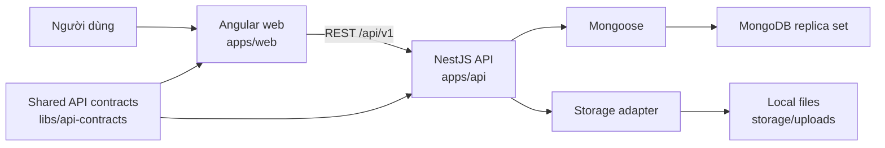

# IDS PMS — Project Overview

## Mục tiêu

IDS PMS là hệ thống web quản lý dự án nội bộ. Phạm vi nghiệp vụ chi tiết vẫn cần được khách hàng xác nhận; kiến trúc hiện tại được dựng để phát triển tăng dần mà không khóa cứng các phần chưa chốt.

## Trạng thái hiện tại

Đã có foundation cùng ba vertical slice Auth/Users, Projects và Tasks chạy xuyên suốt:

- Angular gọi `GET /api/v1/health`.
- NestJS trả trạng thái API và kết nối database.
- Mongoose kết nối MongoDB replica set local.
- Angular có đăng nhập, khôi phục phiên, app shell, dashboard nghiệp vụ, hồ sơ, trang không có quyền và quản lý người dùng.
- Access token chỉ giữ trong memory; refresh token dùng cookie HttpOnly và được xoay vòng phía server.
- NestJS có `login`, `refresh`, `logout`, `me`, danh sách và tạo người dùng; RBAC kiểm tra permission tại backend.
- Angular có danh mục dự án bám mockup IDS: tìm theo mã/tên/chủ đầu tư, lọc trạng thái vận hành/chất lượng dữ liệu, phân trang và trang chi tiết gồm profile, KPI tổng hợp, hợp đồng nhà mạng, tiến độ 5 bước, hoạt động nội bộ và thành viên.
- NestJS có project profile IDS, bộ lọc portfolio, create/read/update project và CRUD membership; creator trở thành owner trong transaction và hệ thống bảo vệ owner cuối cùng.
- Người có `projects.manage` truy cập toàn bộ dự án; người còn lại chỉ thấy dự án mà mình là thành viên.
- Angular có timeline hoạt động trong chi tiết dự án, hỗ trợ đăng bình luận nội bộ, tải thêm theo trang và cập nhật tức thời mà không reload toàn workspace.
- NestJS lưu bình luận bất biến trong `project_activities`; list kiểm tra project scope và phân trang trong một aggregation, còn author name/email được snapshot khi ghi để tránh N+1 khi đọc.
- Angular có trang Tiến độ thi công bám mockup IDS: KPI, lọc trạng thái, nhóm 5 bước theo dự án, khởi tạo kế hoạch và cập nhật ngày/trạng thái.
- NestJS có task list theo project scope, khởi tạo 5 bước idempotent và ràng buộc task hoàn thành phải có ngày kết thúc thực tế.
- Task list join project/membership và tính overview bằng một MongoDB aggregation `$facet`, không query N+1.
- Angular có trang Chất lượng dữ liệu v1: KPI theo phạm vi truy cập, tìm kiếm, lọc cảnh báo, phân trang, liên kết về dự án cần xử lý và khối chất lượng CRM cho hồ sơ thiếu owner/tương tác cuối.
- NestJS tổng hợp xung đột nguồn, thiếu CAPEX, thiếu kế hoạch 5 bước, task quá hạn, thiếu ngày thực tế và chất lượng CRM bằng một aggregation; `$lookup` cơ hội chạy một lần sau `$facet`, không lưu bản sao cảnh báo và không query N+1.
- Angular có trang Hợp đồng nhà mạng theo mockup với KPI, bộ lọc, phân trang, thêm hợp đồng và cập nhật điều khoản; có thể mở từ chi tiết dự án với scope dự án được giữ trên URL.
- NestJS lưu hợp đồng theo project scope; danh sách, KPI và danh mục nhà mạng dùng một aggregation `$facet`, không query N+1.
- Angular có trang Doanh thu v1 theo mockup: KPI năm tài chính, so sánh doanh thu/chi phí theo quý, tìm kiếm, phân trang và ghi nhận số thực tế cho từng dự án/quý.
- Trang chi tiết dự án hiển thị doanh thu/chi phí/lợi nhuận Q1-Q4 theo năm, cho phép người có quyền cập nhật từng quý mà không tải lại toàn bộ workspace.
- NestJS lưu số thực tế trong `revenue_actuals`, upsert theo `projectId + fiscalYear + quarter`; báo cáo, tổng theo quý và độ phủ dự án dùng một aggregation `$facet`, không query N+1.
- Dashboard tổng hợp KPI tài chính, vận hành, hợp đồng, task quá hạn, chất lượng dữ liệu, CRM, doanh thu theo quý và xếp hạng bằng một API/aggregation theo project scope; UI có loading/error/empty state và đổi năm tài chính.
- Angular có báo cáo Hoàn vốn v1 read-only: KPI độ phủ CAPEX, lọc theo kết luận/năm, doanh thu lũy kế và tỷ lệ thu hồi vốn theo dự án.
- NestJS tính hoàn vốn từ CAPEX và `revenue_actuals` đến hết năm được chọn trong một aggregation theo project scope, có pagination và không query N+1.
- Angular có trang Cơ hội kinh doanh v1 theo mockup: KPI 4 giai đoạn, cảnh báo thiếu người phụ trách/tương tác cuối, tìm kiếm, lọc, phân trang và form tạo/cập nhật hồ sơ pipeline.
- NestJS lưu cơ hội độc lập trong `opportunities`, phân quyền đọc/quản lý toàn pipeline và trả overview, danh sách cùng danh mục owner bằng một aggregation `$facet`; chưa tự chuyển cơ hội thắng thầu thành project.
- Mật khẩu hash bằng Argon2id; refresh token chỉ lưu dạng SHA-256 hash; endpoint auth có throttling và CSRF custom header.
- Swagger được phục vụ tại `/api/docs`.
- API có request ID, error contract, structured request log, security headers, body limit, CORS allowlist và rate limit mặc định.
- Health tách liveness `/live` và readiness `/ready`.
- Mongo/API e2e chạy bằng database và cổng riêng, tự dọn dữ liệu test.
- Contract envelope chung nằm trong `libs/api-contracts`; Nx tags kiểm soát hướng phụ thuộc web/API/shared.
- Unit test, API e2e và Chromium e2e đã được thiết lập.

Project hiện giữ các số tổng hợp tùy chọn như số hợp đồng, doanh thu, chi phí và CPĐT để dựng portfolio theo mockup. Module nguồn hợp đồng nhà mạng, doanh thu/chi phí, hoàn vốn read-only, CRM cơ hội và bình luận nội bộ theo dự án đã có lát cắt v1; các module công nợ, tài liệu, thông báo và báo cáo nâng cao chưa được triển khai. Phạm vi quan sát từ mockup và các điểm chưa chốt được ghi tại `docs/mockup-functional-scope.md`.

## Kiến trúc



## Công nghệ đã chốt cho giai đoạn đầu

| Thành phần  | Công nghệ         | Ghi chú                                            |
| ----------- | ----------------- | -------------------------------------------------- |
| Workspace   | Nx monorepo       | Quản lý web, API và e2e trong một repo             |
| Frontend    | Angular 22 + SCSS | SPA, không dùng AngularJS 1.x và không dùng SSR    |
| Backend     | NestJS 11         | REST API, OpenAPI/Swagger                          |
| Data access | Mongoose          | Schema và truy cập MongoDB                         |
| Database    | MongoDB 8         | Replica set một node ở local để hỗ trợ transaction |
| File        | Local filesystem  | Thiết kế qua abstraction để đổi S3/MinIO sau       |
| Test        | Jest + Playwright | Unit, API e2e và browser e2e                       |

## Cấu trúc repository

```text
apps/
  api/          NestJS API
  api-e2e/      API end-to-end tests
  web/          Angular SPA
  web-e2e/      Playwright end-to-end tests
libs/
  api-contracts/ Shared HTTP contracts không phụ thuộc framework
storage/
  uploads/      File runtime local; nội dung không commit
tools/
  ai/           Công cụ hỗ trợ phiên làm việc với AI
.ai-work/       Log và state local của AI; toàn bộ bị Git ignore
```

## Domain dự kiến

Thứ tự phát triển được đề xuất, chưa đồng nghĩa với yêu cầu khách hàng đã chốt:

1. Authentication, users, roles và permissions — đã triển khai.
2. Projects và project membership — đã triển khai lát cắt đầu tiên.
3. Tasks và tiến độ 5 bước theo project — đã triển khai lát cắt đầu tiên.
4. Dữ liệu project đặc thù IDS và portfolio filters — đã triển khai lát cắt đầu tiên theo mockup, vẫn chờ xác nhận nguồn chuẩn/quy tắc import.
5. Chất lượng dữ liệu dạng read-only — đã triển khai lát cắt v1; workflow duyệt/đóng cảnh báo chờ khách xác nhận.
6. Hợp đồng nhà mạng và doanh thu theo quý — đã triển khai lát cắt v1 theo mockup; contract, cách ghi nhận và nguồn import vẫn chờ khách xác nhận.
7. Dashboard nghiệp vụ — đã triển khai v1 từ các nguồn hiện có; công thức và thời điểm chốt số vẫn chờ khách xác nhận.
8. Hoàn vốn — đã triển khai báo cáo read-only v1 từ CAPEX và doanh thu lũy kế; công thức dòng tiền chính thức vẫn chờ xác nhận.
9. Cơ hội kinh doanh — đã triển khai hồ sơ/pipeline v1; chuyển thành project, xác suất và lịch sử hoạt động chờ xác nhận.
10. Bình luận/hoạt động nội bộ theo dự án — đã triển khai v1; chỉnh sửa/xóa, mention, file và notification chờ khách xác nhận.
11. Công nợ, tài liệu và notification sau khi chốt workflow và nguồn dữ liệu.

## Điểm truy cập local

- Web: `http://localhost:4200`
- API health: `http://localhost:3000/api/v1/health`
- API liveness: `http://localhost:3000/api/v1/health/live`
- API readiness: `http://localhost:3000/api/v1/health/ready`
- Swagger: `http://localhost:3000/api/docs`
- MongoDB: `mongodb://localhost:27017`

## Cấu hình

Sao chép `.env.example` thành `.env`. Không commit `.env`.

| Biến                         | Mục đích                                      |
| ---------------------------- | --------------------------------------------- |
| `API_PORT`                   | Cổng NestJS, mặc định 3000                    |
| `E2E_API_PORT`               | Cổng API e2e, mặc định 3100                   |
| `WEB_ORIGIN`                 | Danh sách origin được phép gọi API            |
| `MONGODB_URI`                | Chuỗi kết nối MongoDB replica set             |
| `MONGODB_TEST_URI`           | Database e2e, tên bắt buộc kết thúc bằng test |
| `FILE_STORAGE_ROOT`          | Thư mục lưu file local                        |
| `MAX_UPLOAD_SIZE_MB`         | Giới hạn upload dự kiến                       |
| `JSON_BODY_LIMIT`            | Giới hạn JSON/urlencoded request body         |
| `URLENCODED_PARAMETER_LIMIT` | Số parameter tối đa                           |
| `ENABLE_SWAGGER`             | Bật tài liệu API; mặc định tắt ở production   |
| `THROTTLE_TTL_MS`/`LIMIT`    | Cửa sổ và số request rate limit mặc định      |
| `TRUST_PROXY_HOPS`           | Số proxy tin cậy; mặc định 0                  |
| `JWT_ACCESS_SECRET`          | Khóa ký JWT, tối thiểu 32 ký tự               |
| `ACCESS_TOKEN_TTL_SECONDS`   | TTL access token, mặc định 900 giây           |
| `REFRESH_TOKEN_TTL_DAYS`     | TTL refresh session, mặc định 30 ngày         |
| `AUTH_COOKIE_SECURE`         | Bắt buộc HTTPS cookie; bật ở production       |
| `SEED_ADMIN_*`               | Tùy chọn tạo admin đầu tiên idempotent        |

## Tài liệu liên quan

- `RULES.md`: quy tắc kỹ thuật.
- `DECISIONS.md`: quyết định kiến trúc.
- `AI_WORKFLOW.md`: quy trình cộng tác với AI và log local.
- `README.md`: cách cài đặt và chạy dự án.
- `docs/architecture.md`: ranh giới module và luồng request.
- `docs/api-conventions.md`: contract lỗi, pagination và OpenAPI.
- `docs/testing.md`: test layers và cô lập database e2e.
- `docs/technical-debt.md`: cảnh báo dependency/tooling đã biết và hướng xử lý.
- `docs/mockup-functional-scope.md`: phạm vi tạm thời từ mockup và các điểm còn phải xác nhận.
